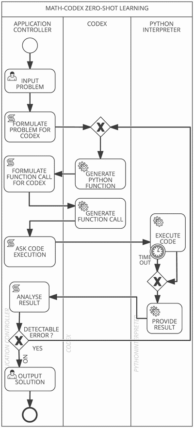

# math-codex

Repository for the paper [Zero-shot mathematical problem solving via Generative Pre-trained Transformers](https://pubs.galatolo.me/galatolomathcodex.pdf)

The outputs of the proposed pipeline and GPT-3 for the whole GSM8K test set are available [here](https://galatolofederico.github.io/math-codex/)

An in-browser demo is available [here](https://colab.research.google.com/drive/1XzTjlbIqbe3f-0WV5o7Ar40szQAB6DY1?usp=sharing)



## Installation

To clone and install the dependencies run

```
git clone https://github.com/galatolofederico/math-codex.git && cd math-codex
virtualenv --python=python3.7 env && . ./env/bin/activate
pip install -r requirements.txt
```

## Interactive Demo

You can use the CLI interface running

```
python pipeline.py
```

Or the [gradio](https://github.com/gradio-app/gradio) interface running

```
python run.py
```

**WARNING: you need an OpenAI API Key enabled to run Codex**

## Replicate experiments

To download the GSM8K dataset run

```
./download-dataset.sh
```

To download our generated completions run

```
./download-completions.sh
```

The downloaded completions will be available in `./completions`

Alternatively to regenerate the completions using Codex and GPT-3 run

```
./generate-all.sh
```

**WARNING: you need an OpenAI API Key enabled to run Codex. Be aware that regenerating the completions can be very expensive**


To evaluate the completions and generate the results run

```
./evaluate.sh
```

results will be available in `./results`


## Contributions and license

The code is released as Free Software under the [GNU/GPLv3](https://choosealicense.com/licenses/gpl-3.0/) license. Copying, adapting and republishing it is not only allowed but also encouraged. 

For any further question feel free to reach me at  [federico.galatolo@ing.unipi.it](mailto:federico.galatolo@ing.unipi.it) or on Telegram  [@galatolo](https://t.me/galatolo)